해당 글은 web3.py로 Dapp을 구현하기 위해 자료조사 중 web3.js에 비해 자료가 너무 없어서 제가 알고 있는 범위에서 최대한 설명드리는 글이며 해외 블로그를 보고 한글로 설명이 되었으면 좋겠다라고 생각하여 작성하였습니다.

참고한 블로그는 맨 하단에 기재하였습니다. 글을 처음 작성해서 문제가 될 시 지우겠습니다

# 1. 준비물
- Visual Studio Code
- node.js
- python 3.8.2
- Flask(프레임 워크)
- Truffle(프레임 워크)
- MetaMask
- Infura(테스트 넷 API)

# 2. 설치
## 2.1 Visual Studio Code 설치

저는 비주얼 코드 환경에서 작업 하기 때문에 비주얼코드를 설치 해주시기 바랍니다.

다른 에디터가 있으신 분들은 해당 에디터를 사용하셔도 됩니다.

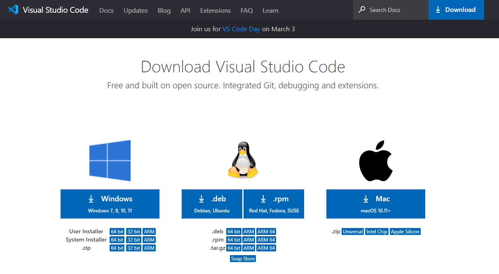

먼저 https://code.visualstudio.com/download 에서 본인 OS에 맞게 다운로드를 해줍니다.

<br/>

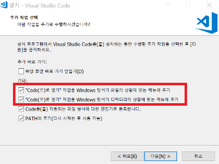

설치 하실때에 해당 두 칸은 꼭 체크를 해주세요!

나중에 윈도우 편집기에서 해당위치에서 VSCode를 바로 불러 올 수 있습니다.

<br/>

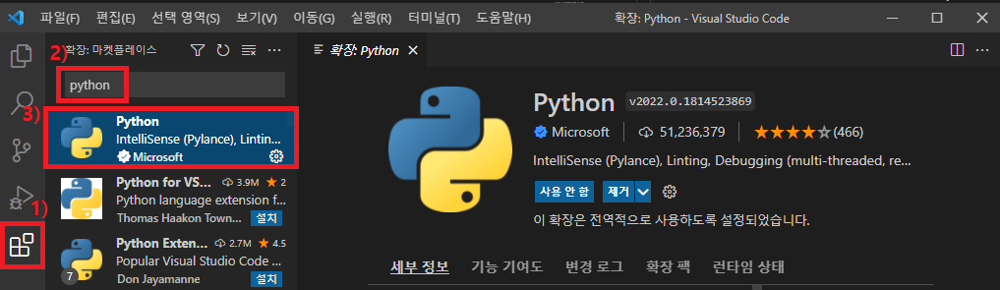

VScode를 설치한 후 python 확장팩을 설치해줍니다.

<br/>

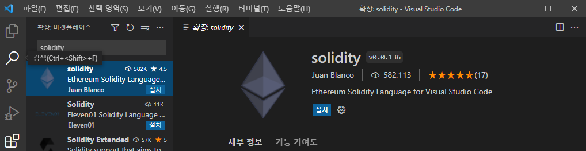

추가로 Solidity 확장팩도 필요하신 분은 다운해주세요.

저는 Remix 사이트가 테스트하기도 편해서 Remix를 이용합니다.

Remix: https://remix.ethereum.org/

<br/>
<br/>

## 2.2 python 설치
저는 python 3.8.2 버전을 사용했지만 2.7이산 버전이면 문제는 없을것으로 보입니다.

기존에 다른 버전 python이 있으신 분은 굳이 버전을 안바꾸셔도 괜찮을 것 같습니다.

혹시나 에러가 난다면 python버전을 3.8.2로 변경 해보세요.

(참조한 사이트에선 2.7이상 버전을 추천하는 것 같습니다.)

https://www.python.org/downloads/

<br/>
<br/>

## 2.3 node.js 설치
Truffle 프레임 워크 사용을 하기 때문에 node.js를 설치 해줍니다.

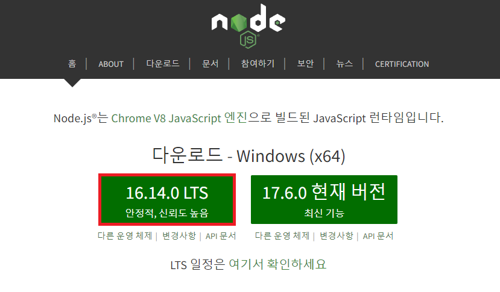

node.js 홈페이지를 검색하셔서 다운로드 해주세요. 링크도 걸어두겠습니다.

Node.js: https://nodejs.org/ko/

<br/>
<br/>

## 2.4 Truffle 설치
Truffle은 솔리디티 언어로 작성된 파일를 컴파일해주고 컨트랙트 생성 및 테스트를 도와주는 프레임 워크이므로 설치를 해줍니다.

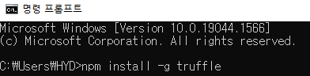

명령 프롬프트를 실행시켜주시고 "npm install -g truffle" 명령어를 입력해서 설치를 해줍니다.

<br/>
<br/>

## 2.5 web3.py 설치
파이썬에서 스마트컨트랙트를 쉽게 이용할 수 있게 함수들을 만들어 놓은 web3.py를 설치해주어야합니다.

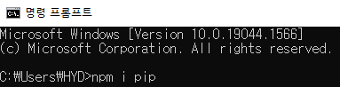

먼저 "npm i pip"를 입력해서 pip를 설치해 줍니다.

<br/>

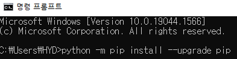

"python -m pip install --upgrade pip"를 입력해서 pip를 최신으로 업그레이드 해줍니다.

<br/>

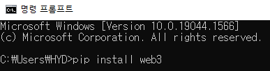

"pip install web3"를 입력 후 설치.

<br/>
<br/>

## 2.6 flask 설치
스마트 컨트랙트에 데이터를 넣고 확인하는 방법을 브라우저로 확인하기 위해서 웹 프레임 워크인 falsk를 설치해줍니다.

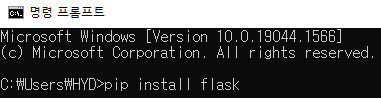

"pip install falsk" 립력 후 설치.

<br/>
<br/>

## 2.7 Metamask 설치 및 이더 받기

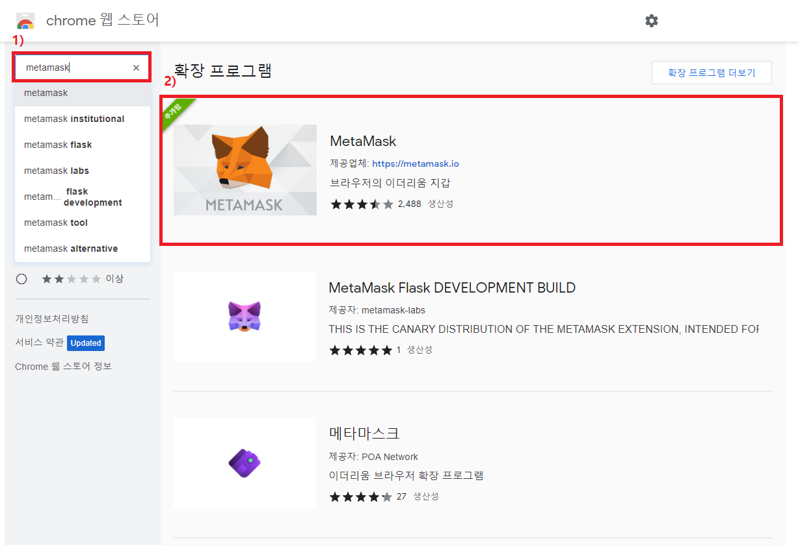

구글 크롬에서 확장프로그램 Metamsk를 다운해주세요

<br/>

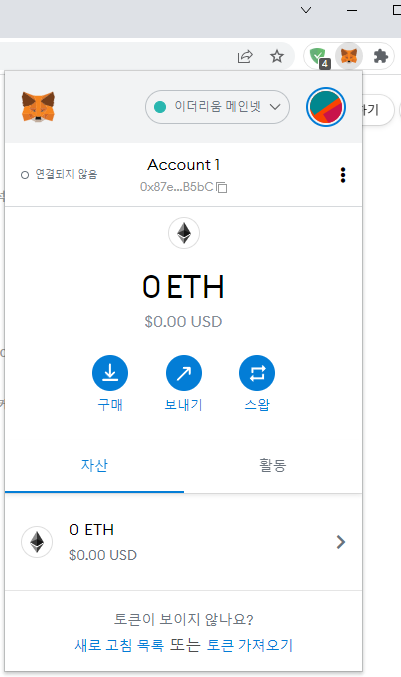

이 화면까지 되셨으면 설치 되신겁니다.

<br/>

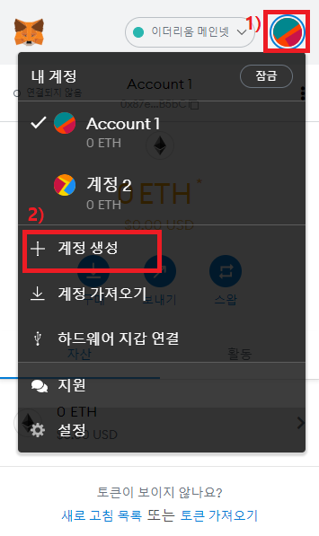

이제 테스트로 거래 할 계정을 만들어주겠습니다.

<br/>

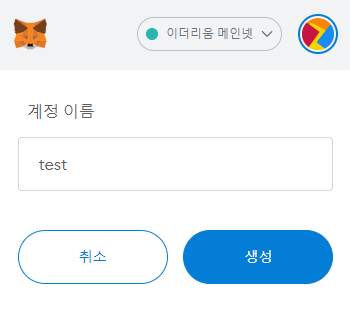

저는 이름을 test로 하겠습니다. 이름은 아무거나 하셔도 상관없습니다.

<br/>

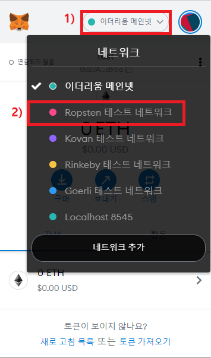

저는 Ropsten 테스트넷을 기준으로 했기 때문에 Ropsten으로 설명드리겠습니다.

생성한 계정을 메인넷에서 Ropsten 테스트 넷으로 변경해줍니다.

<br/>

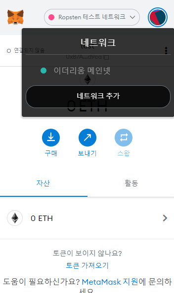

만약 테스트넷이  이미지와 같이 안보이시면 계정 아이콘을 누르시고 설정-고급-테스트 네트워크 보기를 활성화해주시면 됩니다.

<br/>

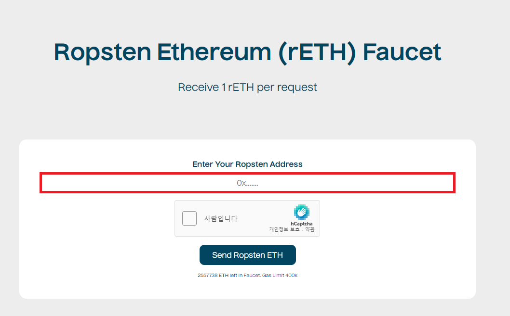

이제 테스트넷을 이용할 때 사용되는 이더를 받아야 하기 때문에 해당 사이트에서 지갑 주소를 입력 해주어야 합니다.

<br/>

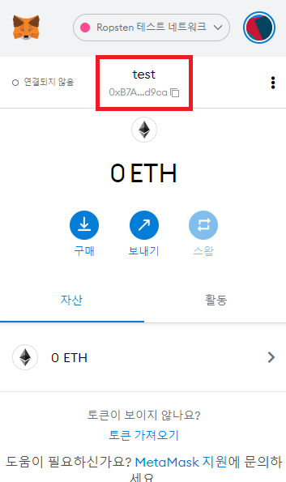

Metamask를 열어 주신 다음에 빨간 네모칸을 눌러주시면 지갑 주소가 복사됩니다.

<br/>

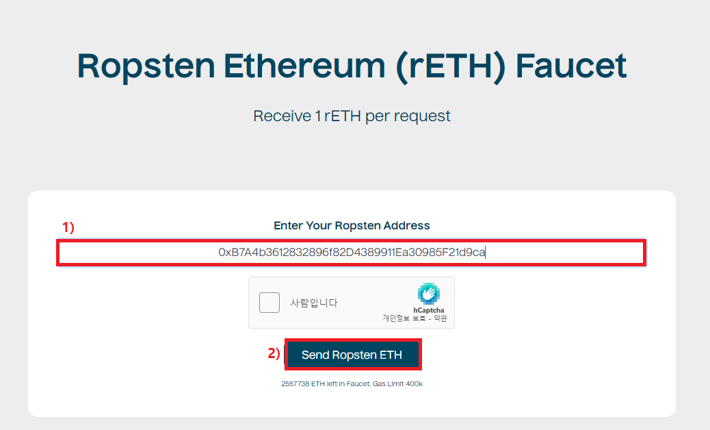

사이트에 붙여넣기를 하신다음 Send Ropsten ETH를 받습니다.

<br/>
<br/>

## 2.8 Infura API 키 발급
테스트넷과 쉽게 연결해주는 Infura API를 발급 받아 보겠습니다.

먼저 https://infura.io/ 에서 회원가입을 해줍니다.

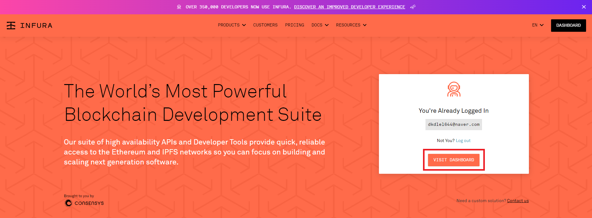

가입 후 대쉬보드를 열어줍니다.

<br/>

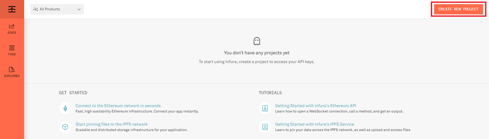

"CREATE NEW PROTJECT"를 눌러줍니다.

<br/>

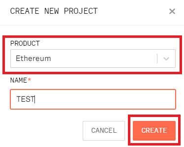

PRODUCT는 이더리움으로 해주고 프로젝트 이름은 아무거나 하셔도 됩니다.

<br/>

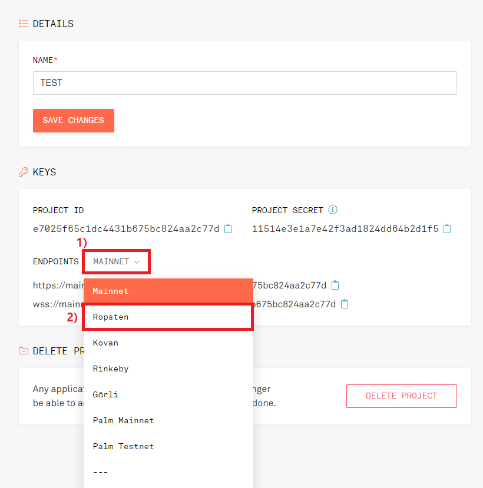

ENDPOINTS를 저희가 사용할 Ropsten으로 해줍니다.

<br/>

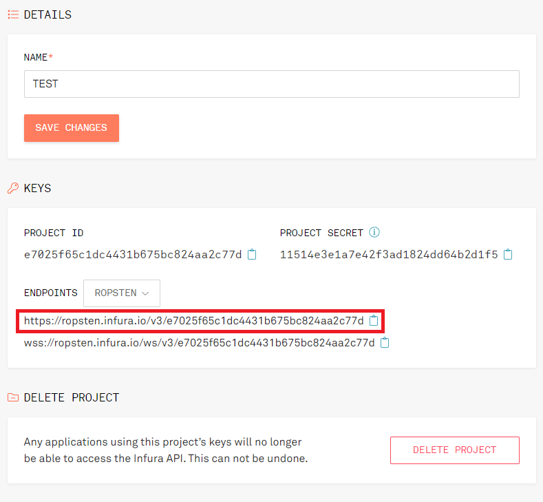

해당 주소가 저희가 나중에 사용할 API 키입니다.


# 3. 스마트 컨트랙트
## 3.1 Truffle로 컴파일하기
프로젝트 작업을 할 폴더를 만들어주세요

저는 바탕화면에 blockchain 폴더를 생성 후 해당 폴더에서 작업을 하도록 하겠습니다.

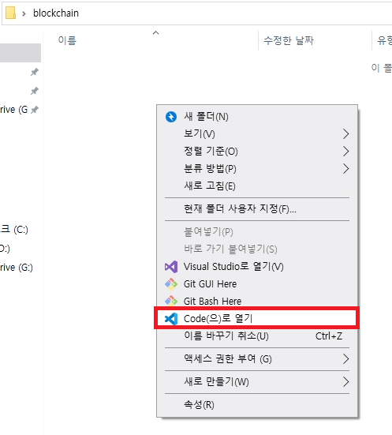

작업 할 폴더에서 오른쪽키를 클릭 후 "Code(으)로 열기"를 클릭합니다.

<br/>

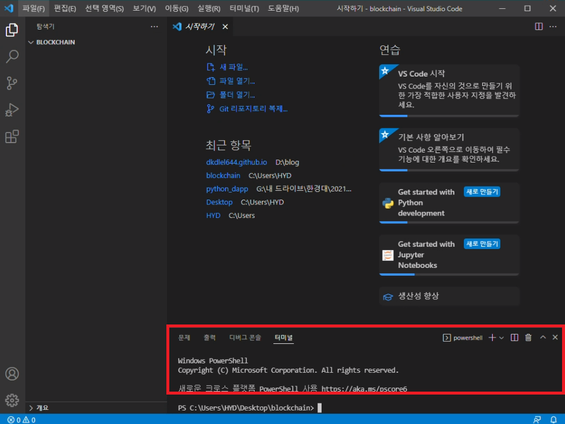

켜진 후 터미널을 키기 위해서 Ctrl+Shift+` 를 눌러줍니다.

<br/>

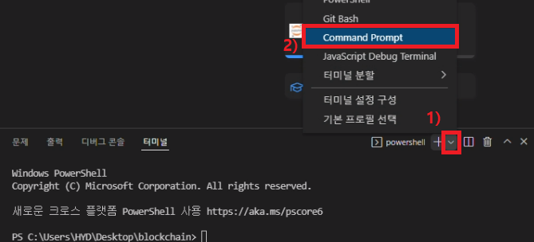

기본적으로 "powershell"이 켜지게 되어있을 텐데 "Command Prompt"로 켜줍니다.

<br/>

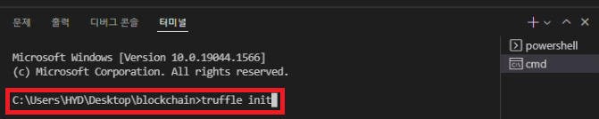

커맨드 창에 "truffle init"을 입력해주어서 truffle에서 제공하는 프레임을 받아줍니다.

<br/>

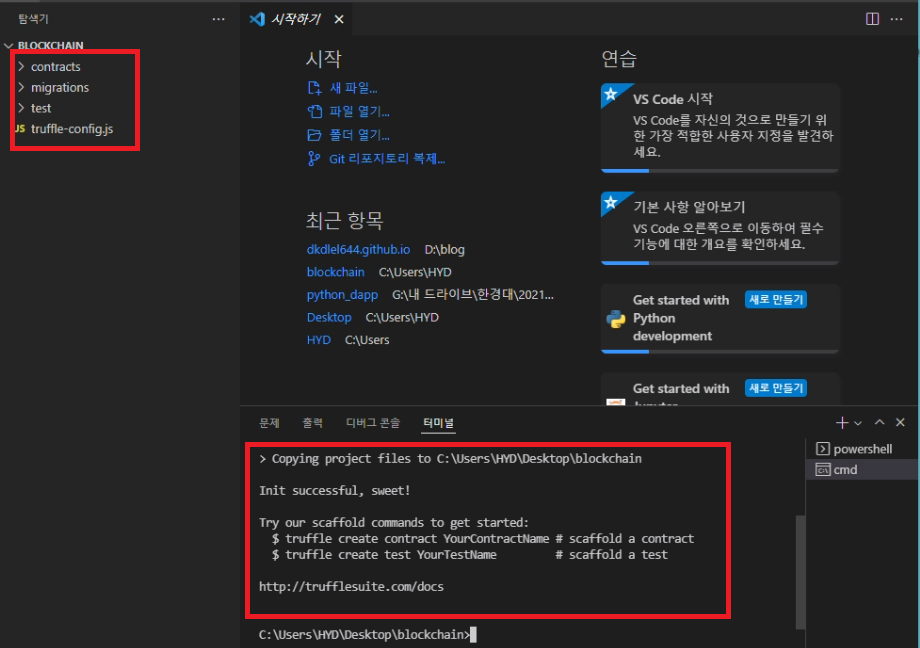

정상적으로 되셨다면 이런 출력과 디렉터리가 나오실겁니다.

<br/>

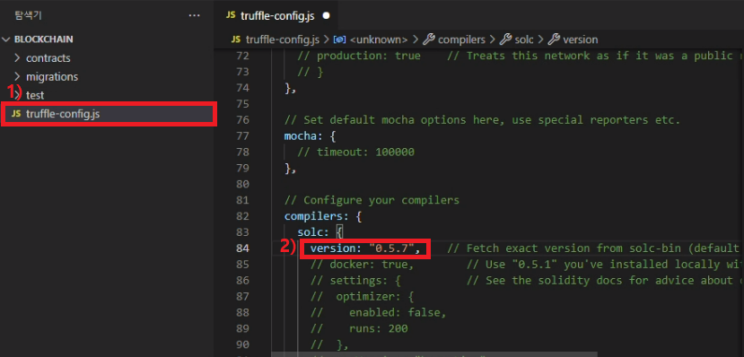

최상위에 있는 "truffle-config.js"를 열어준 후 컴파일러의 버전을 0.5.7로 변경해줍니다.

<br/>

### greet.sol
```
pragma solidity ^0.5.7;
contract greeter{
    string greeting;
    
    function greet(string memory _greeting)public {
        greeting=_greeting;
    }
    function getGreeting() public view returns(string memory) {
        return greeting;
    }
}
```

기본적인 솔리디티 파일인 "greet.sol"을 "contract"폴더 하위에 넣어줍니다.

코드를 간단하게 설명드리면 "greet"함수는 아규먼트를 저장해주는 기능을 하고, "getGreeting"함수는 저장된 변수 값을 반환해주는 함수입니다.

<br/>

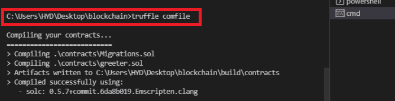

이제 추가한 "greet.sol"을 컴파일을 해주기 위해 터미널에 "truffle comfile"을 입력해줍니다.

<br/>
<br/>

## 3.2 스마트 컨트랙트 배포 (deploy.py)


deploy.py 만들어 준 후 아래의 코드를 넣어줍니다.

deploy.py는 컨트랙트 배포를 해줍니다.

### deploy.py
```python
import json
from web3 import Web3, HTTPProvider
from web3.contract import ConciseContract

w3 = Web3(HTTPProvider("https://ropsten.infura.io/v3/infura_API_KEY")) #infura API키 입력.
print(w3.isConnected())

key="private_Key" #Metamask의 private Key 입력.
acct = w3.eth.account.privateKeyToAccount(key)


truffleFile = json.load(open('./build/contracts/greeter.json')) #컴파일 후 생성된 ".json"파일의 위치 입력.
abi = truffleFile['abi']
bytecode = truffleFile['bytecode']
contract= w3.eth.contract(bytecode=bytecode, abi=abi)

construct_txn = contract.constructor().buildTransaction({
    'from': acct.address,
    'nonce': w3.eth.getTransactionCount(acct.address),
    'gas': 1728712,
    'gasPrice': w3.toWei('21', 'gwei')})

signed = acct.signTransaction(construct_txn)

tx_hash=w3.eth.sendRawTransaction(signed.rawTransaction)
print(tx_hash.hex())
tx_receipt = w3.eth.waitForTransactionReceipt(tx_hash)
print("Contract Deployed At:", tx_receipt['contractAddress'])
```

여기서 주석 읽어보시고 infura API Key, Metamask private Key부분만 수정해줍니다.

<br/>


infura API Key는 이거입니다. 본인 것으로 입력해주셔야합니다!

<br/>

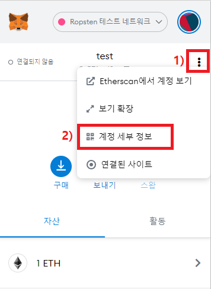

Metamask private Key를 보기위해선 먼저 Metamask에서 "계정 세부 정보"를 눌러줍니다.

<br/>

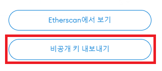

누르시면 해당 버튼들이 보이실 텐데 "비공개 키 내보내기"를 눌러 주신 후 비밀번호를 입력하시면 Metamask private Key를 받아보실 수 있습니다.

<br/>

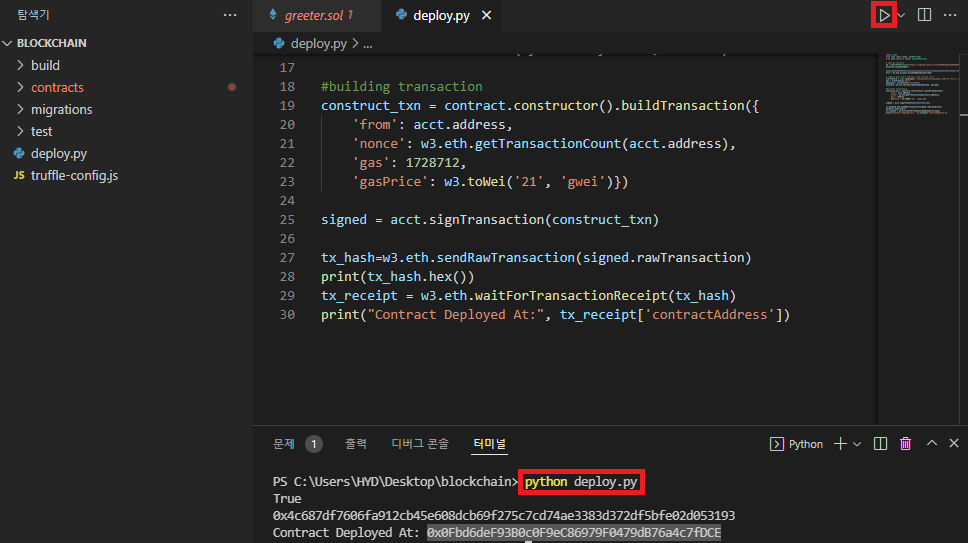

수정한 후 오른쪽 위 실행 버튼을 누르시거나 "python deploy.py"를 실행시켜 스마트 컨트랙트의 주소를 받습니다.

해당 주소는 스마트 컨트랙트 주소이므로 따로 저장해두시는 편이 좋을 것 같습니다.

<br/>
<br/>

## 3.3 스마트 컨트랙트를 DB로 사용한, 플라스크 프레임 워크 웹 만들기 (app.py)

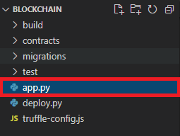

app.py파일을 만들어 준 후 아래의 코드를 넣어줍니다.

```python
import json
from web3 import Web3, HTTPProvider
from web3.contract import ConciseContract
from flask import Flask, render_template, request

w3 = Web3(HTTPProvider("https://ropsten.infura.io/v3/infura_API_Key")) # infura API키를 입력.
print('Web3 Connected:',w3.isConnected())
contract_address = Web3.toChecksumAddress("deployed contract address") #배포된 컨트랙트 주소 입력.
key="private Key" #지갑의 private Key 입력.
account_address= Web3.toChecksumAddress("wallet address") #지갑 주소 입력.
truffleFile = json.load(open('./build/contracts/greeter.json')) #컴파일 후 생성된 ".json"파일의 위치 입력.
abi = truffleFile['abi']
bytecode = truffleFile['bytecode']
contract = w3.eth.contract(abi=abi, bytecode=bytecode)
contract_instance = w3.eth.contract(abi=abi, address=contract_address)

app = Flask(__name__)


@app.route("/")
def index():
    print('Web3 Connected: ',w3.isConnected())
    greeting = contract_instance.functions.getGreeting().call()
    contract_data = {
        'greeting': greeting
    }
    return render_template('index.html',**contract_data)

@app.route("/greet" , methods=['GET','POST'])
def greet():
    greeting_input = request.form.get("write")
    print(greeting_input)
    tx = contract_instance.functions.greet(greeting_input).buildTransaction({'nonce': w3.eth.getTransactionCount(account_address)})
    signed_tx = w3.eth.account.signTransaction(tx, key)
    tx_hash= w3.eth.sendRawTransaction(signed_tx.rawTransaction)
    print('Transaction submitted:', tx_hash.hex())
    tx_receipt = w3.eth.waitForTransactionReceipt(tx_hash)
    greeting = contract_instance.functions.getGreeting().call()
    contract_data = {
        'greeting': greeting
        }
    return render_template('index.html', **contract_data)


if __name__ == '__main__':
    app.run(port=5000, host='0.0.0.0')
```

주석 읽어보시고 infura API Key, deployed contract address, private key, wallet address 부분을 본인의 것으로 수정해주세요.

deployed contract address는 아까 deploy.py에서 배포 후 출력된 주소를 입력해주세요.

private key, wallet address는 배포한 지갑계정으로 하셔도 되고 안하셔도 됩니다만, 동일 지갑계정으로 작성해주시고 테스트넷에 이더만 있으면 됩니다.

<br/>

```html
<!DOCTYPE html>
<html>

<head>
   <title>Greeter Dapp</title>
   <meta charset="utf-8" />
   <meta name="viewport" content="width=device-width, initial-scale=1, user-scalable=no" />
   <link rel="stylesheet" href="../static/css/style.css" />
</head>

<body class="is-preload">
   <div class="main" style="text-align: center;">
      <h1>{{greeting }}</h1>
      <form method="post" action="{{url_for('greet')}}">
         <input type="text" style="width: 50%;" name="write" placeholder="Write Your Greeting Here.."></br>
         <input class="button" type="submit" value="Greet">
         <br>
      </form>
   </div>
</body>

</html>
```

웹으로 보여줄 html이 필요한데 참고한 블로그에서 제공한 html을 사용하겠습니다.

<br/>

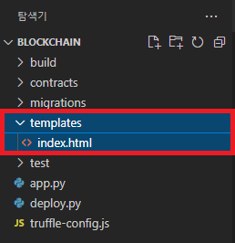

해당 코드를 /templates/index.html로 저장합니다.

<br/>

```css
body {
	background: #f6f5f7;
	display: flex;
	justify-content: center;
	align-items: center;
	flex-direction: column;
	font-family: 'Montserrat', sans-serif;
	height: 100vh;
	margin: -20px 0 50px;
}
input {
	background-color: #eee;
	border: none;
	padding: 12px 15px;
	margin: 8px 0;
	width: 100%;
}
.button{
	border-radius: 20px;
	border: 1px solid #FF4B2B;
	background-color: #FF4E2B;
	color: #FFFFFF;
	font-size: 12px;
	font-weight: bold;
	padding: 12px 45px;
	letter-spacing: 1px;
	text-transform: uppercase;

	transition: transform 80ms ease-in;
}
.button:hover{
	opacity: 0.4;
}
.main {
	background: #FF416C;
	background: -webkit-linear-gradient(to right, #FF4B2B, #FF416C);
	background: linear-gradient(to right, #FF4B2B, #FF416C);
	background-repeat: no-repeat;
	background-position: 0 0;
	color: #FFFFFF;
	width: 30%;
	height: 45%;
  	transform: translateX(0);
	transition: transform 0.6s ease-in-out;
}
```
css도 참고한 블로그에서 제공한 css를 사용하겠습니다.

<br/>

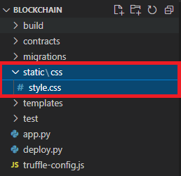

css는 \static\css\style.css로 저장합니다.

<br/>
<br/>

## 3.4 테스트

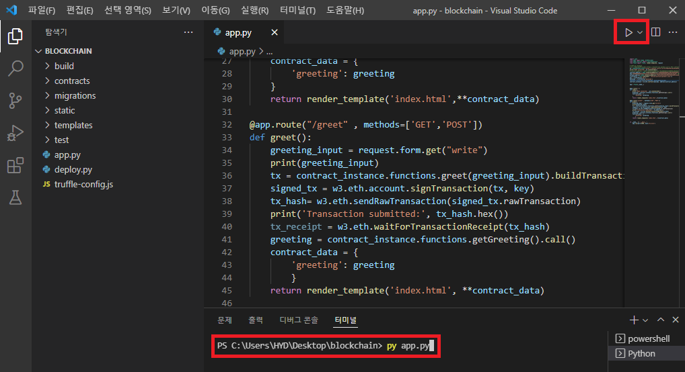

이제 app.py를 실행해보겠습니다. 명령어 "py app.py"또는 우측 상단 실행버튼을 눌러주세요.

<br/>

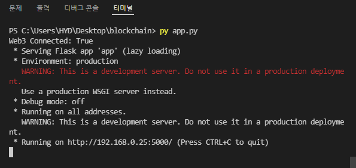

에러 없이 잘 실행이 되었다면 맨 아래 주소가 있는데 주소를 "컨트로+클릭" 해주시면 브라우저가 열리게 됩니다.

<br/>

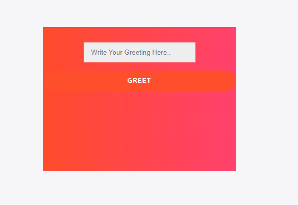

처음 화면에는 컨트랙트에 저장된 값이 없기 때문에 아무런 문자열이 출력되지 않은 것을 볼 수 있습니다.

<br/>

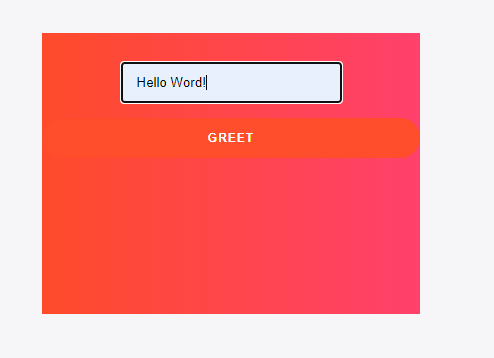

그러면 "Hello Word!"를 입력 후 Greet을 눌러보겠습니다.

누른 후 로딩이 오래 걸리실 텐데 블록체인 특성 상 증명되는 과정으로 오래걸리게 됩니다.

<br/>

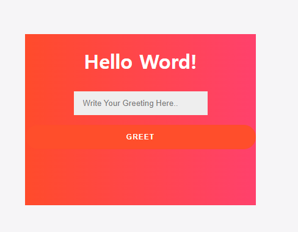

로딩이 다 끝나면 "Hello Word!"문자열이 출력되는 것을 보실 수 있습니다.

<br/>
<br/>
<br/>

이렇게 간단한 Dapp을 만들어 보았습니다.

app.py를 수정하시면 원하시는 자료들을 저장하실 수 있으십니다.

제 설명이 부족하셨다면 참고 블로그를 봐주세요.

[참고] Salman Dabbakuti, DApp Development for Python Programmers, gitconnected, 2019-06-15, https://levelup.gitconnected.com/dapps-development-for-python-developers-f52b32b54f28